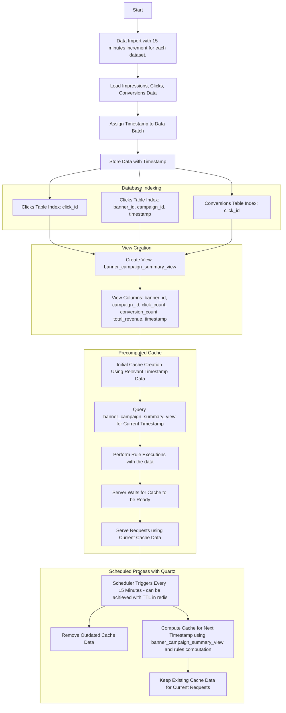
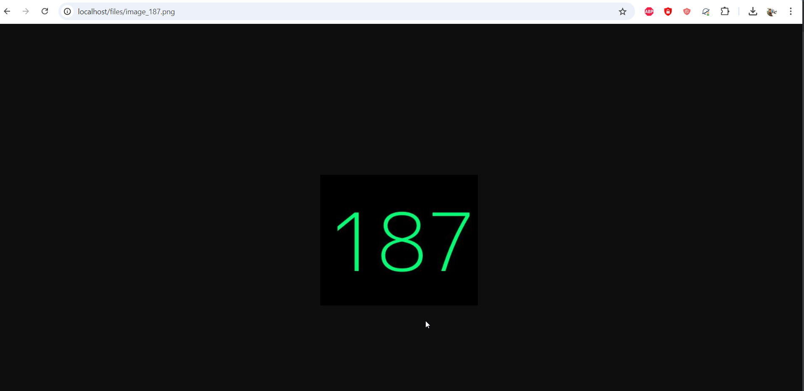

# Campaign Data Processing System

This repository contains a data processing system designed to handle impressions, clicks, and conversions data with a precomputed caching mechanism. The system imports data iteratively every 15 minutes, and the application uses this data to serve requests efficiently by leveraging database indexing and a precomputed cache.

## High-Level Overview

The system processes advertising data, including impressions, clicks, and conversions, and ensures efficient data handling through caching and database indexing. It also incorporates a mechanism to prevent users from seeing the same banner twice in consecutive requests, enhancing the overall user experience.

### Key Features

1. **Iterative Data Imports**: Data is imported Iteratively with 15 minutes increment, with all records in a single batch sharing the same timestamp.
2. **Precomputed Cache**: The cache is initialized with the first two timestamp batches and updated every 15 minutes in the background to include the latest data while removing outdated entries.(see ### Visual Representation of the flow : section for more details).
3. **Database Indexing**: Specific indexes are used to optimize querying performance, making the system efficient in handling high volumes of requests.
4. **User-Banner Mapping**: To avoid showing the same banner to users consecutively, a mapping of `userId` to `lastBannerId` is maintained and updated with each served request.

## Data Entities

The system processes three primary data entities, each imported from a CSV file:

1. **Impressions (`impressions.csv`)**:
    - **Columns**: `banner_id`, `campaign_id`, `timestamp`
    - Represents banner impressions with their associated campaigns.

2. **Clicks (`clicks.csv`)**:
    - **Columns**: `click_id`, `banner_id`, `campaign_id`, `timestamp`
    - Represents clicks on banners linked to campaigns

3. **Conversions (`conversions.csv`)**:
    - **Columns**: `conversion_id`, `click_id`, `revenue`, `timestamp`
    - Represents conversions generated from clicks with associated revenue.

### Timestamps

- The `timestamp` in each entity represents the data import time.
- All data imported in a single iteration share the same timestamp.
- Import iterations occur every 15 minutes. For example:
    - First import timestamp: `current`
    - Next import timestamp: `current + 15m`
    - Following import timestamp: `new current + 15m`
- But all imports happens when the applications starts just the timestamp changes for each data with 15 mins increment.

## Database Indexing

To optimize query performance, the following indexes are used:

- **Clicks Table**:
    - `CREATE INDEX idx_clicks_click_id ON clicks(click_id);`
    - `CREATE INDEX idx_clicks_banner_campaign_timestamp ON clicks(banner_id, campaign_id, timestamp);`

- **Conversions Table**:
    - `CREATE INDEX idx_conversions_click_id ON conversions(click_id);`

These indexes enable efficient querying based on `click_id`, `banner_id`, `campaign_id`, and `timestamp`, significantly improving the system's performance when retrieving related click and conversion data.

## View Creation

After indexing, a database view named `banner_campaign_summary_view` is created to aggregate the necessary data for further processing:

```sql
CREATE VIEW banner_campaign_summary_view AS
SELECT
    i.banner_id,
    i.campaign_id,
    COALESCE(click_details.click_count, 0) AS click_count,
    COALESCE(conversion_details.conversion_count, 0) AS conversion_count,
    COALESCE(conversion_details.total_revenue, 0) AS total_revenue,
    i.timestamp
FROM
    impressions i
LEFT JOIN
    (
        SELECT
            banner_id,
            campaign_id,
            timestamp,
            COUNT(DISTINCT click_id) AS click_count
        FROM
            clicks
        GROUP BY
            banner_id,
            campaign_id,
            timestamp
    ) AS click_details
    ON i.banner_id = click_details.banner_id
    AND i.campaign_id = click_details.campaign_id
    AND i.timestamp = click_details.timestamp
LEFT JOIN
    (
        SELECT
            c.banner_id,
            c.campaign_id,
            c.timestamp,
            COUNT(conv.conversion_id) AS conversion_count,
            SUM(conv.revenue) AS total_revenue
        FROM
            clicks c
        LEFT JOIN
            conversions conv ON c.click_id = conv.click_id
        GROUP BY
            c.banner_id,
            c.campaign_id,
            c.timestamp
    ) AS conversion_details
    ON i.banner_id = conversion_details.banner_id
    AND i.campaign_id = conversion_details.campaign_id
    AND i.timestamp = conversion_details.timestamp
GROUP BY
    i.banner_id,
    i.campaign_id,
    i.timestamp;
```

## Precomputed Cache Mechanism

The system utilizes a precomputed cache to ensure efficient request handling:

1. **Cache Initialization**:
    - Before the server starts serving requests, the precomputed cache is populated with data from the first two import timestamps.
    - Once the cache is ready, the application starts serving requests using the current timestamp data.

2. **Cache Management**:
    - Every 15 minutes, a background job runs asynchronously to manage the cache:
        - **Deletion**: Outdated cache data (older than 15 minutes) is removed.
        - **Computation**: New cache data for the next 15-minute interval is computed and stored.
    - This process ensures that the cache always has the most recent data for the current timestamp, allowing the application to serve requests efficiently.

3. **Serving Requests**:
    - The application serves data from the current timestamp cache, ensuring low latency and high performance.
    - As new data is precomputed asynchronously, the system remains responsive without blocking request handling.

## Backend Data Processing Diagram



## User Request Handling Diagram


### Visual Representation of the flow:

|----t1(active)----||-----(t2)(staged)(Async)-----|

t1(active) will serve all the users

After 15 mins

|----t1(deleted)----|-----(t2)(active)-----||-----(t3)(staged)(Async)-----|

After 15+15 mins

|----t1(deleted)----|-----(t2)(deleted)-----||-----(t3)(active)-----||-----(t4)(staged)(Async)-----|

....

### Example Flow:


### Explanation of Diagrams

- **Backend Data Processing Diagram**: Shows the flow of data import, indexing, view creation, cache management, and the scheduled cache update process using Quartz.

- **User Request Handling Diagram**: Illustrates how the system handles API calls, fetches banner IDs from the cache, checks and updates the user-banner map, and forwards requests to Nginx to serve the correct files.

These diagrams visually represent the system's data processing and user interaction workflows, highlighting the key steps and components involved in ensuring efficient and personalized banner serving.

## Steps to Run the Application

### Building and Running the Nginx Container to Serve Banner Images - Can be a similar behaviour to AWS S3

1. **Navigate to the Nginx Folder in the Application Git Repository:**
    - Use your terminal or command line to navigate to the folder where the Nginx Dockerfile is located within your application's repository.

2. **Build the Nginx Docker Image:**
    - Run the following command to build the Docker image for Nginx:
      ```bash
      cd nginx
      docker build -t my-nginx .
      ```

3. **Run the Nginx Container:**
    - Use the following command to run the Nginx container, mapping the desired port and mounting the directory containing banner images:
      ```bash
      docker run -d -p 80:80 -v <system_mount_path>:/usr/share/nginx/html/files/images my-nginx
      ```
    - Replace `<system_mount_path>` with the path on your system where the banner images are stored. For example:
      ```bash
      docker run -d -p 80:80 -v /d/data/banner_images/images:/usr/share/nginx/html/files/images my-nginx
      ```
    - This command runs the Nginx container in detached mode (`-d`), maps port 80 of the host to port 80 of the container, and mounts the local directory containing images to the Nginx web server's directory (`/usr/share/nginx/html/files/images`).

These steps will set up the Nginx server to serve banner images as needed by the application, ensuring that all images are accessible via the Nginx container.

### Building and Running the Maven Application Container

1. **Build the Maven Docker Image:**
    - Use the following command to build the Docker image for your Maven application:
      ```bash
      docker build -t my-maven-app .
      ```

2. **Run the Maven Application Container with Volume Mounting:**
    - To run the container and mount the directory containing your CSV datasets, use the following command:
      ```bash
      docker run -d -p 9000:9000 -v <system_csv_path>:/app/src/main/resources/dataset/csv my-maven-app
      ```
    - Replace `<system_csv_path>` with the path on your system where the CSV files are stored. For example:
      ```bash
      docker run -d -p 9000:9000 -v /d/data/csv:/app/src/main/resources/dataset/csv my-maven-app
      ```
    - This command runs the Maven application container in detached mode (`-d`), maps port 9000 of the host to port 9000 of the container, and mounts the local directory containing CSV files to the application's expected directory (`/app/src/main/resources/dataset/csv`).

3. **Run the Maven Application Container Without Volume Mounting:**
    - If you do not need to mount any volumes, you can run the container with the following command:
      ```bash
      docker run -d -p 9000:9000 my-maven-app
      ```
    - This command starts the application on port 9000, making it accessible at `http://localhost:9000`.

These steps will help you set up and run the Maven application container, ensuring it has access to the necessary datasets and is configured correctly to serve requests on the specified port.


### Sample Input 

http://localhost:9000/campaigns/50?userId=10

### Sample Output



### Microservice & Event Driven Architecture Model (design overview)

[](https://mermaid.live/edit#pako:eNrFVk1vozAQ_SsWp602PVCpF7RaKSFJi1raKKS5QBU5MCFWwY5sU6lq8993sJMA-ejubX3Cnjdv7HkPw6eTigwcz8kl3azJbJhwgkNVS7swZgUsQsppDnIRgXxnKVhIPTImIdVMcDIbNKv9eAo0I340N-nqlfy6vv5NBvEun_gFVcojQbkRUg-pprvAa8MxIHWKH0-kSEEpMoVUyEy1EL5BDAdu_CPSQoKpV5NdnYLiSbUsmFqT0TtwrYgW5IGu3mgLaYjq9CVV4JHLlAg0pIEbB-FkOoqi4PkpOgPw3dh_DPyHc7E5xp6f5qPpPrmBBBbx1ddasmWlQX3h2iIDTVmh2jU9sqScoy4s65GUlhvKcm4mmpWgNK60W3GG12947VY9khYsfeuS9C7UaZHPz5DPW-TNWbGC4O8gFbrmuExTWwIKVe0NATzbd-hgTKNfs4FRHKJN0KVkIMUbyG8y_f0J_tHO49gXXFUl7N2zkqI88c_Ymvzu2OS7XHlq8TvTsvuDxQ07oTwj_TyXkFMNxnytlPud52_aVvX74aQf3D0toll_Fl11zIRQkxKh3zqwFml0RruopV0nz2sMgKJpI9YlF1o5U1FxfVB0gc3otS2wC7cde3zeMJ7TgmV1P6ZVfZ80gNC-ivHLxoYhYwoFTtfQ4Tlo31cfPD3R_bL29XiII-TLsHJWXxzTitdSyQ_i3pKQ8fZ2DNxs6dHegcYq3Q6iJkcZj3tVzy1_c3hj7ksuN634m7WnbtxtWRMwxU3w4ITEseChnXvks7vhg4buSageLW8gQIEmYtV4R_W-zbg5k9FN2PYu7eane1sy_l_21Ey3iXN6Jw1Nl0d2MjKTsZ0Etv9uwp2eg9dHSVmGX2lzhMTRayghcTx8zGBFq0InTsK3CKWVFhF63PG0rKDnSFHla8db0ULhrDKvyZBR9Eh5WEVR8WsX2v8A8zuw_QOXZGdR)


### Query Campaign 

[](https://mermaid.live/edit#pako:eNrFVMFu2zAM_RVClx6WouiGXQxsRWM3g5EuQJ3mMMhBoVpMLMyWMkleWyT-98lSGntrl-42XmxSfNTTE8UtKRRHEpG1ZpsSbpNcgjPT3IfAIg2BzrjQWFihJNyO--gNXRjUcNOgflrC6elnyGiGPxo0FhbZdQRnBas3TKylOfzdCX7ROFTKP4XPMtRDyXP5B4P4GTNH_VMU-BafSxorabWqKtQRTESFiXqQlWK8jy8H6Z7ymHr-kCEXxm1ZlDjIGfucXVxi8T0s7iDejpmU7uBpAlePwlhz0faIOCC-odlBQr-gS2QWOz1gpTTM1kI-whnMPyxfYGZqB1dOQbNRksODsCWczBTch93Qb3UygCUeNqEd9U4PsGpQ32_XiQDPKhyR2p_-LX1T-rpI6R1Hy0RlaE5CRhL8CLZ9VmdW1K453LWev1jqbNAkLsGgBbXaH9-FzOgo4v0riN8B7ehvbN6df6yF_C-cerfNyZEbmlul2Rr_9S1M6aAT9pjBlU1961zTrioaSGtX2oSW61pGMqcMMAOHTh8y6x_GfkRk3rkMzsQ701ySEalR10xwN2S8sjmxJdaYk8j9clyxprI5yWXrUllj1fxJFiSyusER0apZlyRasco4r9lw94oSwZwY9SHqes3x_xrGmJ9m7S8px3Kh)
